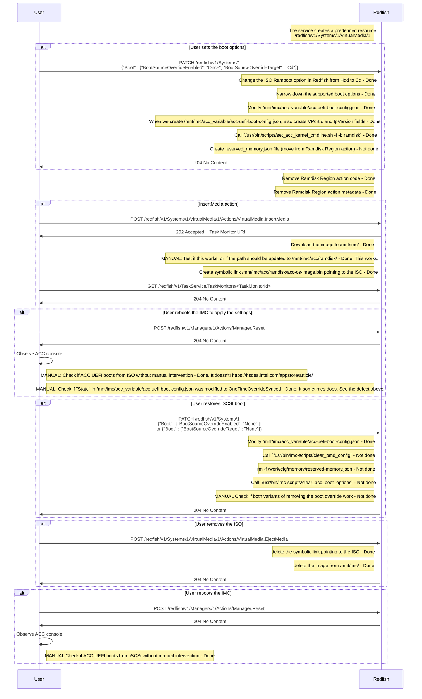

```mermaid
sequenceDiagram

participant User
participant Redfish

note left of Redfish: The service creates a predefined resource <br/> /redfish/v1/Systems/1/VirtualMedia/1

alt User sets the boot options
  User ->> Redfish : PATCH /redfish/v1/Systems/1 <br/> {"Boot" : {"BootSourceOverrideEnabled": "Once", "BootSourceOverrideTarget" : "Cd"}}

  note left of Redfish: Change the ISO Ramboot option in Redfish from Hdd to Cd - Done
  note left of Redfish: Narrow down the supported boot options - Done
  note left of Redfish: Modify /mnt/imc/acc_variable/acc-uefi-boot-config.json - Done
  note left of Redfish: When we create /mnt/imc/acc_variable/acc-uefi-boot-config.json, also create VPortId and IpVersion fields - Done
  note left of Redfish: Call `/usr/bin/scripts/set_acc_kernel_cmdline.sh -f -b ramdisk` - Done
  note left of Redfish: Create reserved_memory.json file (move from Ramdisk Region action) - Not done

  Redfish ->> User : 204 No Content
end

note left of Redfish: Remove Ramdisk Region action code - Done
note left of Redfish: Remove Ramdisk Region action metadata - Done

alt InsertMedia action
  User ->> Redfish : POST /redfish/v1/Systems/1/VirtualMedia/1/Actions/VirtualMedia.InsertMedia
  Redfish ->> User: 202 Accepted + Task Monitor URI

  activate Redfish
  note left of Redfish: Download the image to /mnt/imc/ - Done
  note left of Redfish: MANUAL: Test if this works, or if the path should be updated to /mnt/imc/acc/ramdisk/ - Done. This works.
  note left of Redfish: Create symbolic link /mnt/imc/acc/ramdisk/acc-os-image.bin pointing to the ISO - Done

  User ->> Redfish : GET /redfish/v1/TaskService/TaskMonitors/<TaskMonitorId>
  Redfish ->> User: 204 No Content
end

alt User reboots the IMC to apply the settings
  User ->> Redfish : POST /redfish/v1/Managers/1/Actions/Manager.Reset
  Redfish ->> User : 204 No Content

  User ->> User: Observe ACC console
  note right of User: MANUAL: Check if ACC UEFI boots from ISO without manual intervention - Done. It doesn't! https://hsdes.intel.com/appstore/article/#/18038709133
  note right of User: MANUAL: Check if "State" in /mnt/imc/acc_variable/acc-uefi-boot-config.json was modified to OneTimeOverrideSynced - Done. It sometimes does. See the defect above.
end

alt User restores iSCSI boot
  User ->> Redfish : PATCH /redfish/v1/Systems/1 <br/> {"Boot" : {"BootSourceOverrideEnabled": "None"}} <br/> or {"Boot" : {"BootSourceOverrideTarget" : "None"}}

  note left of Redfish: Modify /mnt/imc/acc_variable/acc-uefi-boot-config.json - Done
  note left of Redfish: Call `/usr/bin/imc-scripts/clear_bmd_config` - Not done
  note left of Redfish: rm -f /work/cfg/memory/reserved-memory.json - Not done
  note left of Redfish: Call `/usr/bin/imc-scripts/clear_acc_boot_options` - Not done
  note left of Redfish: MANUAL Check if both variants of removing the boot override work - Not done

  Redfish ->> User : 204 No Content
end

alt User removes the ISO
  User ->> Redfish : POST /redfish/v1/Systems/1/VirtualMedia/1/Actions/VirtualMedia.EjectMedia

  activate Redfish
  note left of Redfish: delete the symbolic link pointing to the ISO - Done
  note left of Redfish: delete the image from /mnt/imc/ - Done

  Redfish ->> User: 204 No Content
end

alt User reboots the IMC
  User ->> Redfish : POST /redfish/v1/Managers/1/Actions/Manager.Reset
  Redfish ->> User : 204 No Content

  User ->> User: Observe ACC console
  note right of User: MANUAL Check if ACC UEFI boots from iSCSi without manual intervention - Done

end
```