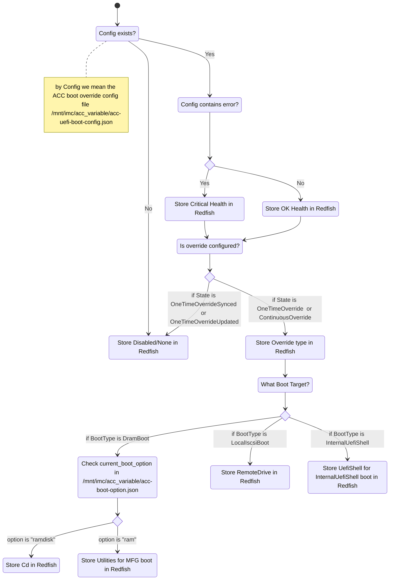
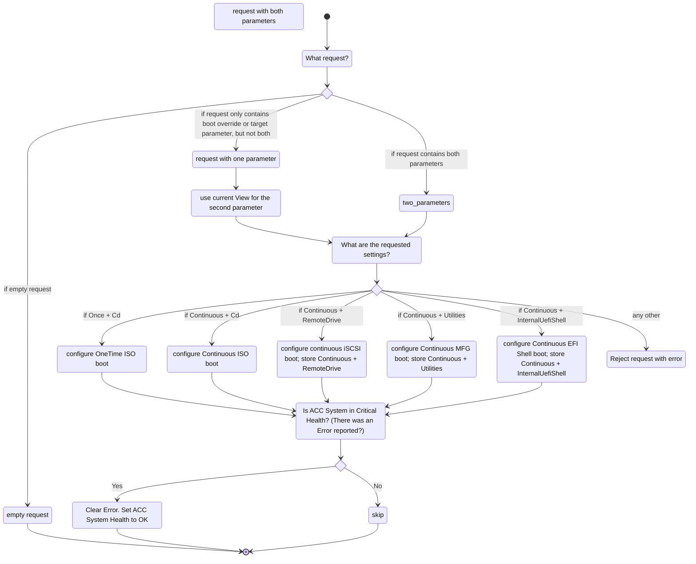

# ACC Boot Override management using Redfish including installing a custom OS for the ACC

## Intro

This document explains the implementation introduced for MEV-TS 2.0.

## Boot targets in scope
* MFG - a form of DramBoot
* ISO - a form of DramBoot - Redfish distinguishes between these two by checking additional configuration files
* Eval - a form of LocalIscsiBoot
* OS installed from ISO - labeled "Other" by ACC UEFI
* EFI Shell - InternalUefiShell

## Boot targets out of scope
* LocalIscsiBoot_ISO - until we have a use case that involves it
* PXE - missing API for network settings in Redfish
* HTTP - missing API for network settings in Redfish

## Initial conditions

The primary source of information is the ACC boot override config file `/mnt/imc/acc_variable/acc-uefi-boot-config.json` .

For IPU with MFG image, the override config file shall initially contain
```json
{
  "BootType": "DramBoot",
  "Error": "",
  "IpVersion": "n/a",
  "State": "ContinuousOverride",
  "VPortId": 0
}
```

For IPU with Eval image, the override config file shall initially contain
```json
{
  "BootType": "LocalIscsiBoot",
  "Error": "",
  "IpVersion": "n/a",
  "State": "ContinuousOverride",
  "VPortId": 0
}
```

## Discovery of the current settings
Applies to both Redfish startup and detecting config changes made by ACC UEFI in runtime, eg. using a discovery loop.



## Update loop
Redfish shall refresh its View every two minutes by re-reading the ACC boot override config file and checking for changes.
The interval is selected as a compromise between noticing changes quickly and overusing the resources of the IMC.
We assume that no changes are done by the user using other means than Redfish API. However, the configuration may be changed by ACC UEFI.
During the update, Redfish shall follow the logic from the previous section, with one caveat: if there was an ISO boot override configured previously,
and now it got disabled or changed to another boot target, Redfish shall clear the BMD configuration override needed to store the ISO in RAM.

## Applying user settings
Redfish shall not validate if the Eval (RemoteDrive) or Mfg (Utilities) boots are possible (eg. if the ACC partition was overwritten with something else).
In the same spirit, it shall not check if an ISO image is inserted for DramBoot from ISO. It shall, however, create a symlink to the ISO, if it is already inserted.

Redfish standard does not have any semantics (e.g. error messages in Base registry) for requiring that two parameters be PATCHed at the same time.
For this reason, the server allows sending a PATCH with no keys or just one setting - in the spirit of RESTful services.
If the PATCH request is empty, it's a valid no-op.
If it contains just one parameter (boot override target or override setting), the Redfish server shall use current View as the second parameter to validate the combination.


