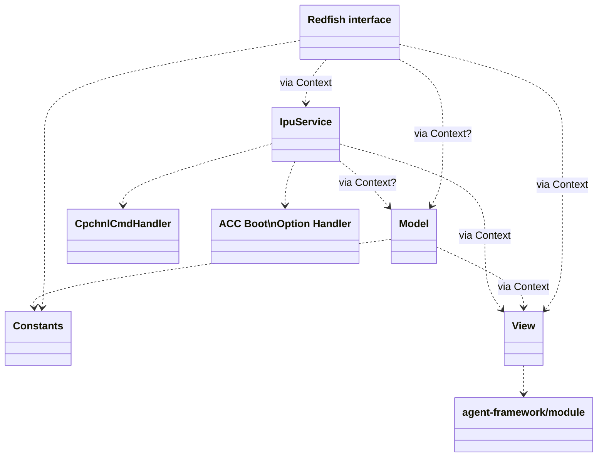

# Code design

The purpose of document is to provide guidelines for a design that
will allow the code to be unit-testable with reasonably high coverage.

## Long term goal

Introduce a `class Context` that will hold the dependencies
used by other classes. For example:

```c++
SomeEndpoint::get(ContextSPtr ctx, Request, Response) {

  ctx->view->get_manager<SomeResource>(...);

  ctx->service->reset_acc(resetType);
  ctx->service->change_acc_boot_options(boot_options);
}
```

In the example above, a Context instance is provided
to all endpoint methods, and it provides a pointer to the "view"
(which is an object containing a set of GenericManager instances
managing all the cached resources; thus replacing the current
use of singletons); and the "service" is the "IPU Service",
the entry point of the library containing the IPU business logic.

In production code, the "view" and "service" public members are
instantiated to actual objects. In unit tests, Context is instead
initialized with mocks.

Context is provided to various components of the application
wrapped in a shared pointer, to allow for co-ownership between
different threads. Concurrency issues should be resolved _inside_
the dependencies that it provides.

The dependencies shall be stored in the Context either as pointers
(preferably, smart pointers), or as references; so that they could
be substituted with child mock classes.

## Note: initializing and clearing up the Context

The Context class will contain dependencies from low-level
interfaces to high-level services. It is imperative that they
be initialized and destroyed in the correct order: initialize
from low level to high level, deinitialize in the reverse order.

## Note: Potential for Redfish service reusability

If, at some point in the future, there'll come a need to reuse
our codebase for other use-cases, the interface between endpoints
and the "service" library could be generalized to encompass
different types of services than just IPU.

```c++
SomeEndpoint::get(ContextSPtr ctx, Request, Response) {

  ctx->service->reset(Component::SomeType, uuid, reset_type);

  ctx->service->cmd(Cmd::SetBootOptions, boot_options);
}
```

# Getting there

## Diagram of planned dependencies

The following diagram is a draft of the planned structure of the server.
Note that in a dependency graph, the arrow points from the dependent on
the dependency.



Model was previously conceived as a set of classes and functions providing
higher-level operations on the View. Currently, it provides find/try_find
utilities (searching for resources based on parameters extracted from URL)
and health_rollup utility for the endpoints, as well as IdPolicy for
IpuService (rules for assigning resource ids). It should possibly be split.
Or perhaps View should be merged into the same library?

TO DO: cover EventService, TaskService, split `Redfish interface` into
details (multiplexer, connector ...); cover other components after that.

Basic conclusions:
* Constants should be split from `application-rest` target into a smaller
library.
* Model, if we keep it, could also be extracted from the same target as
a library. However, its dependency on server::Parameters class is a problem.

## Singleton context

To avoid modifying all the codebase at once, instead of adding
the Context pointer in a lot of places, we shall make the class
a singleton that returns a shared pointer on `get_instance()`. This will
have the benefit of allowing us to put dependencies in the
Context and use them where they are needed.

When all code will be refactored to use Context pointer received
in parameters or in constructors instead of from the singleton
method, the singleton aspect of the class shall be removed.

### Note

This requires a second Singleton implementation. The currently
available template stores a unique pointer and exposes raw
pointers to the object in store.

## IpuService

An entry point to the IpuService shall be added to the application
context in App class, to be made available to endpoints.

The IpuService will have the following dependencies:

* CpchnlCmdHandler, a class calling CpChnl commands,
* TBD, a class managing ACC Boot options,
* The View class containing the GenericMangers of resources.

As no other component of the application uses the first two
dependencies, they can be provided to the IpuService either as
constructor parameters or as members of the context. Both ways
will allow for overriding them with mocks.

First method:

```c++
// in App class
// the constructors of IpuService and the handlers are TBD

// in this method, the IpuService receives its dependencies directly

ContextSPtr ctx = Context::get();
ctx->service = make_smart<IpuService>(ctx, CpchnlCmdHandler{}, BootOptionHandler{});
```

Second method

```c++
// in App class
// the constructors of IpuService and the handlers are TBD

// in this method, the IpuService receives its dependencies via context

ContextSPtr ctx = Context::get();
ctx->cpchnl_handler = make_smart<CpchnlCmdHandler>{};
ctx->boot_option_handler = make_smart<BootOptionHandler>{};
ctx->service = make_smart<IpuService>(ctx);
```

## Next steps

TODO: plan for adding Context as a param to endpoints etc.
