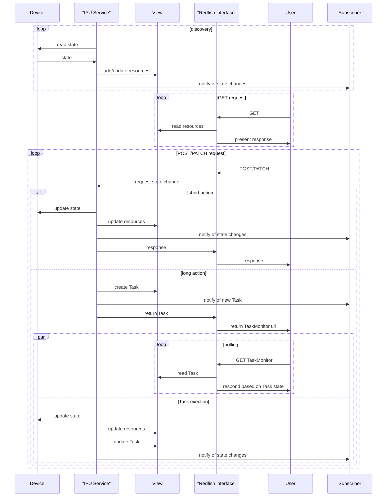

```mermaid
sequenceDiagram
participant Device
participant "IPU Service"
participant View
participant "Redfish interface"
participant User
participant Subscriber
loop discovery
  "IPU Service" ->> Device : read state
  Device ->> "IPU Service" : state
  "IPU Service" ->> View : add/update resources
  "IPU Service" ->> Subscriber: notify of state changes
end
loop GET request
  User ->> "Redfish interface" : GET
  "Redfish interface" ->> View : read resources
  "Redfish interface" ->> User : present response
end
loop POST/PATCH request
  User ->> "Redfish interface" : POST/PATCH
  "Redfish interface" ->> "IPU Service": request state change
  alt short action
    "IPU Service" ->> Device : update state
    "IPU Service" ->> View : update resources
    "IPU Service" ->> Subscriber: notify of state changes
    "IPU Service" ->> "Redfish interface" : response
    "Redfish interface" ->> User : response
  else long action
    "IPU Service" ->> View : create Task
    "IPU Service" ->> Subscriber: notify of new Task
    "IPU Service" ->> "Redfish interface" : return Task
    "Redfish interface" ->> User : return TaskMonitor url
    par
      loop polling
        User ->> "Redfish interface" : GET TaskMonitor
        "Redfish interface" ->> View : read Task
        "Redfish interface" ->> User : respond based on Task state
      end
    and Task exection
      "IPU Service" ->> Device : update state
      "IPU Service" ->> View : update resources
      "IPU Service" ->> View : update Task
      "IPU Service" ->> Subscriber: notify of state changes
    end
  end
end
```
